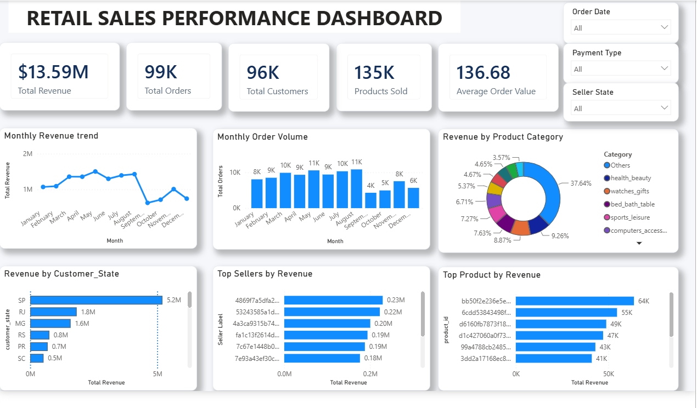

# Retail Sales & Customer Analytics Platform

## Project Overview

A complete retail analytics project covering data preparation, integration, PostgreSQL database engineering, SQL business analysis, and an interactive Power BI dashboard.

The project turns retail transaction data into a structured analytical platform for sales, customer, product, seller, payment, delivery, and review analysis.

## Project Objectives

- Clean and explore the source datasets.
- Integrate multiple retail datasets into a consistent analytical structure.
- Build a PostgreSQL analytical database using the `analytics` schema.
- Create reusable SQL views and business-analysis queries.
- Develop an interactive Power BI dashboard.
- Support business analysis across revenue, orders, customers, products, sellers, geography, payments, delivery, and reviews.

## Project Workflow

```text
Raw Data
   ↓
Data Cleaning & EDA
   ↓
Data Integration
   ↓
Master Dataset
   ↓
PostgreSQL Database
   ↓
SQL Business Analysis
   ↓
Power BI Dashboard
   ↓
Business Insights
```

## Project Phases

### Phase 1 — Data Cleaning & EDA

Performed data cleaning and exploratory analysis using Python and Jupyter notebooks to understand data quality, distributions, missing values, and relationships across the source datasets.

### Phase 2 — Data Integration

Integrated the source datasets into a consistent analytical structure and prepared the data for downstream SQL and BI analysis.

### Phase 3 — Master Dataset Creation

Created processed master datasets used as the foundation for the analytical workflow.

### Phase 4 — PostgreSQL Database

Built the `retail_sales_analytics` PostgreSQL database with an `analytics` schema.

Verified analytical tables and row counts:

| Table | Rows |
|---|---:|
| `customers` | 99,441 |
| `orders` | 99,441 |
| `order_items` | 112,650 |
| `products` | 32,949 |
| `sellers` | 3,095 |
| `payments` | 103,886 |
| `reviews` | 99,224 |
| `category_translation` | 71 |
| `geolocation` | 1,000,163 |

The database implementation includes table creation, data import, primary keys, foreign keys, check constraints, indexes, analytical views, and validation queries.

### Phase 5 — SQL Business Analysis

Created a structured SQL analysis library covering core and advanced business questions.

`sql/09_business_queries.sql` contains Queries 1–50 covering core sales, customer, product, seller, delivery, review, payment, monthly order, contribution, and performance analysis.

`sql/10_advanced_business_queries.sql` contains Queries 51–60, including running totals, month-over-month growth, moving averages, top customer/seller analysis by state, revenue quartiles, customer order values, contribution percentages, seller ranking, and monthly revenue differences.

## Power BI Dashboard

The final dashboard provides an interactive view of retail performance.

### Dashboard Preview



### KPI Cards

- Total Revenue
- Total Orders
- Total Customers
- Products Sold
- Average Order Value

### Dashboard Visuals

- Monthly Revenue Trend
- Monthly Order Volume
- Revenue by Product Category
- Revenue by Customer State
- Top Sellers by Revenue
- Top Products by Revenue

### Interactive Filters

- Order Date
- Payment Type
- Seller State

### Top-N Analysis

The dashboard includes:

- Top 10 Sellers by Revenue
- Top 10 Products by Revenue
- Top 10 Product Categories with an `Others` grouping

The Top-N category view keeps the dashboard readable while preserving the contribution of lower-ranked categories.

## Key Business Questions

The project is designed to answer questions such as:

- How is revenue changing over time?
- How does monthly order volume change?
- Which product categories generate the most revenue?
- Which products generate the most revenue?
- Which sellers contribute the most revenue?
- Which customer states generate the most revenue?
- Which payment methods contribute most to sales?
- How does delivery performance vary?
- How are review scores distributed?
- Which customers and sellers have the strongest performance?

## Tools & Technologies

- **Python** — Data cleaning, exploration, and integration
- **Pandas** — Data preparation and transformation
- **Jupyter Notebook** — EDA and data integration workflow
- **PostgreSQL** — Analytical database
- **SQL** — Business and advanced analytics
- **Power BI** — Interactive dashboard and visualization
- **Git / GitHub** — Version control and documentation
- **Git LFS** — Large processed datasets and Power BI file

## Project Structure

```text
Retail-Sales-Customer-Analytics-Platform/
│
├── data/
│   └── processed/
│       ├── master_dataset.csv
│       └── master_dataset.xlsx
│
├── notebooks/
│   ├── Data_Integration.ipynb
│   └── EDA_and_Data_Analysis.ipynb
│
├── powerbi/
│   └── Retail_Sales_Analytics.pbix
│
├── sql/
│   ├── 01_create_tables.sql
│   ├── 02_import_data.sql
│   ├── 03_primary_keys.sql
│   ├── 04_foreign_keys.sql
│   ├── 05_check_constraints.sql
│   ├── 06_indexes.sql
│   ├── 07_views.sql
│   ├── 08_validation.sql
│   ├── 09_business_queries.sql
│   └── 10_advanced_business_queries.sql
│
├── utils/
├── images/
├── reports/
├── exports/
├── .gitignore
├── .gitattributes
├── requirements.txt
└── README.md
```

## Reproducibility

1. Clone the repository.
2. Install the Python dependencies listed in `requirements.txt`.
3. Review the notebooks in `notebooks/` for the data preparation and integration workflow.
4. Set up PostgreSQL and create the `retail_sales_analytics` database.
5. Run the SQL scripts in the `sql/` directory in sequence.
6. Open the Power BI file in `powerbi/` to explore the dashboard.

## Repository Notes

Large processed datasets and the Power BI file are managed with Git LFS.

## Project Status

- Data Cleaning & EDA — Complete
- Data Integration — Complete
- Master Dataset — Complete
- PostgreSQL Database — Complete
- SQL Business Analysis — Complete
- Power BI Dashboard — Complete
- Documentation & GitHub — In progress

## Author

**Ismail Pasha**

Retail Sales & Customer Analytics Platform — Data Analytics Portfolio Project
